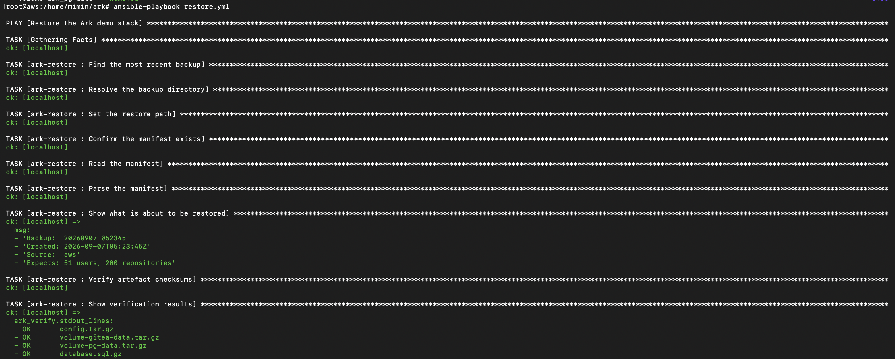
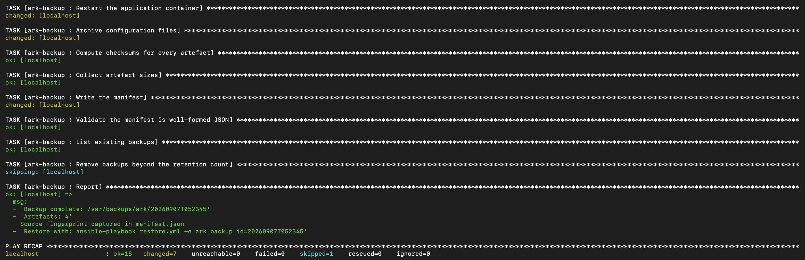
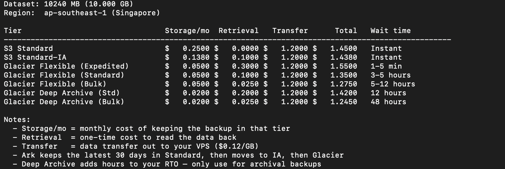

# Ark

**Disaster recovery for people who left AWS — but still want AWS as their safety net.**

Ark treats a cheap Ubuntu VPS as production and AWS as an automated,
drill-tested recovery target. It backs your stack up to S3, keeps a near-zero-cost
pilot light in AWS, rebuilds your application on EC2 when things go wrong, and
proves it works by running failover drills that measure real RTO and RPO.

> **Status: work in progress.** Building in public. See the roadmap below.

---

## The problem

Running production on a $5/month VPS instead of AWS is a perfectly sane
decision. Egress alone makes the difference stark: AWS charges up to $0.09/GB
outbound, while providers like Hetzner include 20 TB per instance.

But almost nobody who makes that move has a disaster recovery plan. If the VPS
dies, the provider's region has an incident, or the account gets suspended,
there is no second site — just backups sitting in a bucket that have never been
restored.

AWS sells an answer to this (Elastic Disaster Recovery), but it is proprietary,
paid, and agent-based. There is no open-source equivalent for the case where
**production is not already in AWS.**

## What Ark does

```
  Ubuntu VPS (production)                    AWS (pilot light)
  ┌──────────────────────┐                   ┌──────────────────────┐
  │  App + PostgreSQL    │  ──► backup ──►   │  S3 ──► Glacier      │
  │  Docker Compose      │     + manifest    │                      │
  │  Nginx + TLS         │                   │  Launch template     │
  └──────────┬───────────┘                   │  (no running EC2)    │
             │                               │  Route 53 zone       │
             │                               └──────────┬───────────┘
             │                                          │
             └───────── Route 53 health check ──────────┘
                        fails ──► DNS failover ──► EC2 boots + restores
```

**Four parts:**

1. **Backup** — an Ansible role captures database dumps, Docker volumes,
   configuration and certificates from the VPS, writes a manifest with SHA-256
   checksums, and ships everything to S3 with a lifecycle policy down to Glacier.
2. **Pilot light** — a Terraform module keeps only the cheap parts running: VPC,
   security groups, a launch template, a Route 53 hosted zone and a health check.
   No EC2 instance is running until it is needed.
3. **Rehydrate** — an Ansible playbook turns a bare EC2 instance into a working
   copy of production: verify checksums, restore volumes and database, start the
   stack, confirm the app actually responds.
4. **Drill** — a Bash script runs the whole failover in an isolated VPC on a
   schedule, times it, verifies data integrity, tears everything down, and emits
   a report with measured RTO and RPO.

The drill is the point. A recovery plan that has never been executed is a
hypothesis, not a plan.

## Why drills verify bytes, not row counts

Before writing any backup code, I tested whether the verification could
actually detect data loss. I destroyed both volumes, redeployed the stack,
and re-ran the seed script.

Row counts came back identical — 51 users, 200 repositories, 400 actions.
The Git object store hash did not match.

Git commit objects embed timestamps, so re-creating the same logical data
produces different bytes. Every row count check passed on an instance that had
lost all of its original data.

This is why Ark backs up volumes rather than replaying application state, and
why a drill only passes when the content hash matches. A recovery that produces
*equivalent* data is not a recovery.

The verification screenshots below are from a full destroy and restore cycle:
`docker compose down -v`, then `ansible-playbook restore.yml`.





One detail worth noting: the health check retries once before passing. The
application needs a few seconds after restart before it accepts traffic, so
a restore that checks health immediately would report failure on a recovery
that actually succeeded. Recovery tooling has to wait for readiness, not
just for the process to start.

## Example drill report
*From Drill #001, run on 2026-09-09. Full history in [`docs/drills.md`](docs/drills.md).*
```
Drill #001                          2026-09-09

RTO:  1m 58s   (target < 15m)  PASS
RPO:  182m     (target < 6h)   PASS

  Provision EC2       0m 20s
  Instance ready      0m 04s
  Download backup     0m 02s
  Restore             0m 25s
  Verify              0m 12s

Database:         PASS
Volume integrity: PASS
Application:      PASS

RESULT: PASS
```

## Cost

Idle cost is dominated by DNS, not compute:

| Item | Monthly |
|---|---|
| Route 53 hosted zone | $0.50 |
| Health check (non-AWS endpoint) | $0.75 |
| S3 + Glacier (small dataset) | ~$0.11 |
| EC2 (drills only, ~2 hrs) | ~$0.02 |
| **Total** | **~$1.40** |


You can run the calculator yourself: `./scripts/cost.sh` or `./scripts/cost.sh 10240` for a 10 GB estimate.



## Limitations

Stated up front, because a DR tool that oversells itself is worse than none.

- **DNS caching bounds your RTO.** Route 53 needs several consecutive failed
  health checks before it acts, and resolvers still honour TTL. With a 60-second
  TTL, realistic failover is 2–5 minutes — not seconds. If you need sub-second
  failover, you need anycast or a load balancer, not DNS.
- **RPO equals your backup interval.** Ark does not do continuous replication.
  Hourly backups mean up to an hour of data loss.
- **Restore time scales with data size.** The drill numbers above are for a small
  dataset. Test with your own.
- **Glacier retrieval is slow and charged.** Deep Archive can take hours and
  retrieval fees vary by an order of magnitude between Bulk and Standard. Keep
  recent backups in Standard or Standard-IA if you care about RTO.
- **v1 targets one shape of workload:** a Dockerised application with PostgreSQL.

## Prior art

Related projects, and how Ark differs:

- [`scottmillers/route53-failover`](https://github.com/scottmillers/route53-failover)
  — Terraform demo of Route 53 DNS failover between two EC2 instances in two AWS
  regions. Closest in mechanism, but primary and secondary are both AWS.
- [`gigingeorge/disaster-recovery`](https://github.com/gigingeorge/disaster-recovery)
  — Packer, Jenkins, Ansible and Terraform to rebuild infrastructure from the
  latest AMI. Entirely within AWS, and triggered manually.
- **AWS Elastic Disaster Recovery** — the commercial answer. Proprietary, paid,
  and requires a replication agent on each source machine.
- **Velero** — excellent, but Kubernetes-native. Ark targets plain VPS hosts.
- **restic / rclone** — the transport layer Ark builds on conceptually. They move
  bytes; they do not rebuild a running system or cut DNS over.

Every DR-with-Terraform guide found during research assumes the primary is
already in AWS. Ark starts from the opposite assumption.

If you know of a project that already does this, please open an issue — I would
rather contribute than duplicate.

## Roadmap

- [x] Ansible backup role with checksummed manifest
- [x] Verified local restore: full destroy, restore, byte-identical
- [x] S3 bucket, lifecycle policy and least-privilege IAM via Terraform
- [x] Pilot light module: VPC, launch template (Route 53 pending domain)
- [ ] Route 53 health check and failover records
- [x] Rehydration playbook with integrity verification (via drill.sh)
- [x] Drill CLI with RTO/RPO measurement and Markdown reports
- [x] Restore cost calculator across Glacier retrieval tiers
- [x] One real AWS integration drill (Moto unit tests planned for CI)

## Built with

Terraform · Ansible · Python · AWS (S3, Glacier, EC2, Route 53, IAM, VPC)

## License

Apache License 2.0 — see [LICENSE](LICENSE).

## Author

Rendy Achmad Syafii — Site Reliability Engineer, Surabaya, Indonesia.
[LinkedIn](https://linkedin.com/in/rendy-achmad/) · rendyachmadevops@gmail.com

Ark grew out of building a disaster recovery centre from scratch for a
university infrastructure of 400+ virtual machines. This is that pattern,
rebuilt in the open with AWS as the recovery site.
